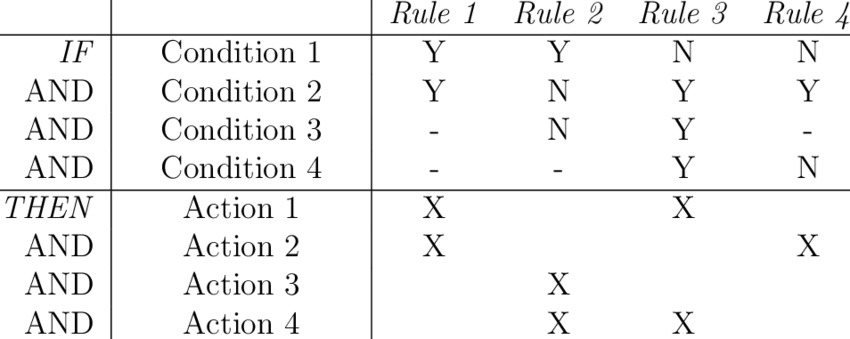
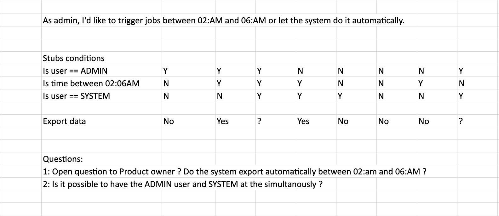
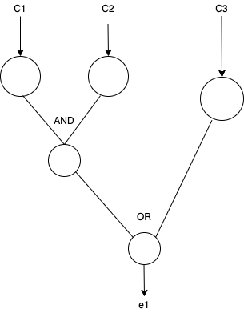
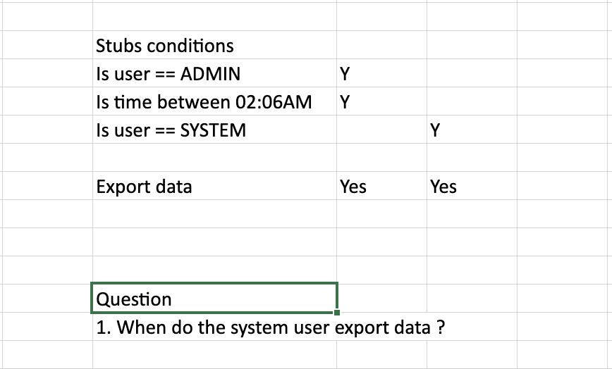
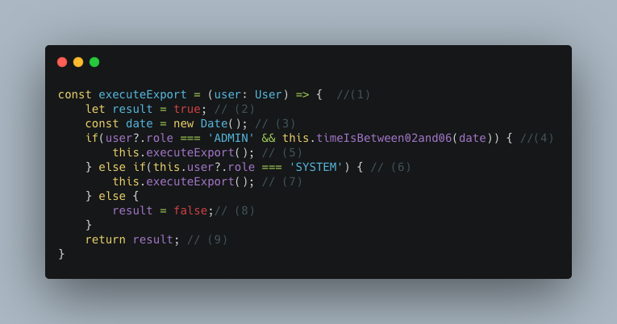
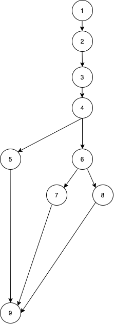
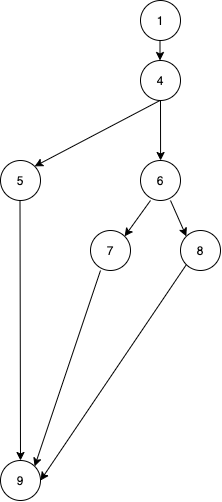

# Unit Testing in Angular

## Agenda

* Introduction
* Part One: Testing strategies
* Part Two: Applied testing strategies in Angular
* Conclusion
* Q/A

## Introduction

Unit testing is the practice of software engineering for automating test of individual units of a program with the intention to detects defects. Although the relation between unit tests and software quality remains unclear, some studies have shown that teams practicing unit test had lower software defects.

## Part One

The most important consideration in program testing is the design and creation of test cases. How any case will be required to test the software ? It is practically impossible. Given constraints in time and cost, it is of the best interest to think about What subset of all tests case has the highest probability of detecting the most errors ? To this question, there exist different strategies which are:

* Functional Testing
* Structural Testing

### Functional Testing

Functional Testing is a higher level testing in which we validate that the software is working as specified. Functional Testing happens early in the Software Testing lifecycle at the specification phase. It help deduce test scenarios and find early bug or incoherence in the software. There exist many techniques, but we are going to evaluate two of them:

* Decision Table
* Cause-Effect Graphing Techniques

#### Decision Table

Decision create a structure that make it easier to visualize business logic cases.

##### Structure



##### Steps to create

* List all stubs conditions (m)
* Calculate the number of possible rules: `Number of Rules N = 2^m (m: number of stubs conditions)`
* Place all the conditions in a table
* Check covered conditions
* Fill the table with actions

#### Example



#### Summary

* Provide great overview of possible scenario
* Provide new insight and missing assumptions of state(i.e: If we have YYY)
* However can become unusable if initial number of stubs conditions is too hight.

### Cause-Effect Graphing

One drawback of decision table is that the number of stub conditions can explode quickly and makes the technic useless. Image having 9 conditions, we will end up with `n = 2^9 = 512 rules`. So testing combination can be very large.

Cause-Effect Graphing is the use of Graph in Combination with Logical operator (AND, OR, NOT) to design software requirements. Cause-Effect Graphing help reduce the initial testing combination and help select, in a systematic way, a high-yield of test cases.

#### Steps to create a Graph

1. Identify all causes
1. Identify all effects
1. Design cause and effect graph
1. Apply constraints
1. Design limited entry decision table from graph
1. Write test cases using every column of the decision table

#### Example

> As an Admin I would like to export data between 02-06AM or let the system do it automatically.

##### Solution

###### Causes

* c1: Is Admin
* c2: We are between 02-06 AM
* c3: It is admin

###### Effects

* e1: Export data

###### Graph



###### Decision Table

We can see from this picture that there are three test three test cases:

* IS ADMIN and Is between 02-06 AM then export data
* Is system then export data. (When ? On user click ? between 02-06: AM) ?
* Nothing if neither (ADMIN and between 02-06 am) or IS SYSTEM



#### Summary

* Easy to produce minimal test subset sufficient for the specification

### Structural Testing

Structural testing is, essentially looking into the implementation and deduce tests cases that will cover the implementation. This happens generally late in the implementation phase of the software.

#### Path coverage using Cyclomatic complexity

Cyclomatic complexity is the deduction of possible executions from the analysis of the implementation of a program/function. It help create a subset of test that greatly satisfy the coverage of a given implementation.

##### Example

Let's consider the current function for exporting data:



###### The corresponding path diagram



Cyclomatic complexity:

V = e - n + 2P = 10 - 9 + 2 = 3

###### We have the simplified graph



Cyclomatic complexity:

V = e - n + 2P = 8 - 7 + 2 = 3

###### The following possible executions path that need to be covered

> a: 1 -> 4 -> 5 -> 9

> b: 1 -> 4 -> 6 -> 7 -> 9

> c: 1 -> 4 -> 6 -> 8 -> 9


###### Disadvantage

This implementation doesn't tell us if the functionality is correct or not. For example do the Product Owner expect the 'SYSTEM' user to be able to execute export only between 02-06 am ? It is hence important to very the business logic using a Decision Table
or a Cause-Effect graph before starting an implementation.

#### Data Flow Testing

You have been invited to a party with a specific dress code lately. What do you do when dressing ? You test all different clothes
combinations until you find the perfect match.

In control flow testing, we find various paths of a program and design test cases to execute
those paths. We may like to execute every statement of the program at least once before the
completion of testing.

The dress code refer to a test path, and the clothes combinations refer to data. When testing a program, it is a great idea
to put that program under different type of data and see if the tested path still come to an end.

##### Example

```javascript

function dataToString(input: any): string { // (1)
    if(input.prop2.startWith(input.prop1)) { // (2)
        return input.prop2; // (3)
    }
    return input.prop1; // (4)
}

```

######  Paths

> P1: 1 -> 2 -> 4

> P2: 1 -> 2 -> 3


##### Data flow

For P1 we might have the possible data:


```javascript

const state = {
    state0: {
        input: {
            prop1: 'abc xyz',
            prop2: 'abc'
        },
        expected: ' xyz'
    },
}
```

For P2 we might have the possible data:

```javascript

const state = {
    state0: {
        input: {
            prop1: 'xyz',
            prop2: 'abc'
        },
        expected: 'xyc'
    }
}

```

##### However there are more state that can interrupt the flow of the program

1. Used variables that are not initialized (**)
2. Side effect mutations

##### Example of state that could interrupt the flow of the program

```javascript
 const state = {
     state0: {
         input: undefined,
         expected: //should throw an undefined error
     },
     state1: {
         input: {
             input1: 'abc xyz',
             input2: undefined // should throw an undefined error
         }
     },
 }
```

##### Notes

We do not always have to test all the possible state set. If we have strong knowledge from other part of the system, we can skip
some impossible state.
i.e: If we know `prop1` or `prop2` might never be null or undefined due to a backend validation, then we shouldn't need to 
write a test for that.

But again, this depends on your team and how you want to write forward with the tests. Offensive coding / Defensive coding.

## Part Two: Applied testing strategies in Angular

Testing an Angular application involve writing isolated unit tests for each of its architectural components. Angular
architectural component include `components`, `services`, `pipes`, `directives`. However every Angular Architectural Component (AAC)
require a special unit testing strategy since they serve different purpose. The following table derive the strategy:


                
|                |Decision table | Cause-Effect Graphing | Path Coverage | Data Flow |
|----------------|---------------|-----------------------|---------------|-----------|
|Component       |       x       |          x            |       x       |    x      |
|Directive       |       x       |          x            |       x       |    x      |
|Service         |               |                       |       x       |    x      |
|Pipe            |               |                       |       x       |    x      |

So in the following sections we will take a look to some example of writing:

* Decision table and UI Testing in Angular
* Cause-Effect Graphing and UI Testing in Angular
* Path Coverage and UI Testing (*ngIF, ngClass, ngFor) in Angular
* Data Flow and UI Testing in Angular

### Angular Component/UI Testing

Angular component testing refer to writing unit tests simulating user interactions with the application. Some actually simplify this
process by only testing component's exposed methods. The are many elements that we can test in a component:

1. *ngIf
2. *ngFor
3. *ngClass
4. Presentation of Informations to the user(Text interpolation, question mark operators, translations)
5. User actions (Click, Form submit, Form validation)
6. Navigation
7. Network interactions

Angular components are not static html texts. They are smart templates that execute specifics business logics, depending of the
state of the component or of the user action. Hence, testing a component becomes easy, as, we just need to apply one of the testing strategy discussed previously.


### Decision table and UI Testing in Angular
